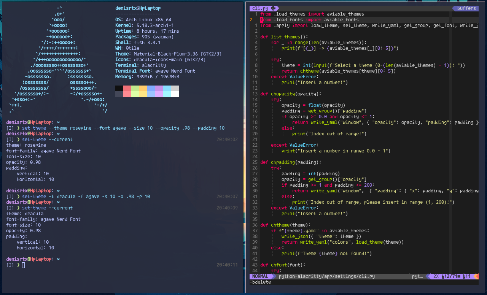

# python-alacritty
Esta instrucciones te permitiran tener estas configuraciones para ejecutarlas en tu maquina local.



# Pre-requisitos
Instalar las dependencias segun tu sistema operativo linux.
```bash
sudo pacman -S alacritty python python-pip
```
* Puedes instalar alacritty con rust, instrucciones [aqui](https://github.com/alacritty/alacritty/blob/master/INSTALL.md).

Instalar dependencias para usar en el cli.
```bash
pip install pyyaml argparse
```

Instalar las fuentes necesarias de Nerd Fonts.
* [Mononoki NF](https://github.com/ryanoasis/nerd-fonts/releases/download/v2.1.0/Mononoki.zip)
* [Caskaydia NF](https://github.com/ryanoasis/nerd-fonts/releases/download/v2.1.0/CascadiaCode.zip)
* [Agave NF](https://github.com/ryanoasis/nerd-fonts/releases/download/v2.1.0/Agave.zip)
* [Hack NF](https://github.com/ryanoasis/nerd-fonts/releases/download/v2.1.0/Hack.zip)
* [Ubuntu Mono NF](https://github.com/ryanoasis/nerd-fonts/releases/download/v2.1.0/UbuntuMono.zip)

Llevar las fuentes a la carpeta de las fuentes
```bash
sudo mkdir /usr/share/fonts/mononoki /usr/share/fonts/caskaydia \
/usr/share/fonts/agave /usr/share/fonts/hack /usr/share/fonts/ubuntumono

sudo mv ~/Downloads/Mononoki.zip /usr/share/fonts/mononoki && cd /usr/share/fonts/mononoki && sudo unzip Mononoki.zip
sudo mv ~/Downloads/CascadiaCode.zip /usr/share/fonts/caskaydia && cd /usr/share/fonts/caskaydia && sudo unzip CascadiaCode.zip
sudo mv ~/Downloads/Agave.zip /usr/share/fonts/agave && cd /usr/share/fonts/agave && sudo unzip Agave.zip
sudo mv ~/Downloads/Hack.zip /usr/share/fonts/hack && cd /usr/share/fonts/hack && sudo unzip Hack.zip
sudo mv ~/Downloads/UbuntuMono.zip /usr/share/fonts/ubuntumono && cd /usr/share/fonts/ubuntumono && sudo unzip UbuntuMono.zip
```

# Comenzando
* Clonar este repositorio
```bash
git clone https://github.com/denis360/python-alacritty.git ~/.config/alacritty
```

### Ahora vamos a instalar la aplicacion de linea de comandos
```bash
cd ~/.config/alacritty/python-alacritty
sudo python setup.py install
sudo pip install -e .
```

Ahora ya deberias de tener el enlace simbolico *set-theme [ARGS]*
* Intenta usar tu nueva herramienta de terminal
```bash
# Puedes saber tus configuraciones actuales
set-theme --current # o puedes usar -c
# Puedes establecer un tema usando --theme  o -t
set-theme -t iceberg-dark
# O puedes elegir un tema con el siguiente comando
set-theme --list # O puedes usar -l
```
* Ahora cierra y abre otra terminal de alacritty e intenta algo como esto:
```bash
set-theme --font agave --size 10 --theme hybrid
```

## Comandos:
| Comando                  | Funcion                                     |
|--------------------------| --------------------------------------------|
| set-theme --theme O -t   | Establece un thema                          |
| set-theme --opacity O -o | Establece transparencia de fondo            |
| set-theme --font O -f    | Establece un tipo de fuente                 |
| set-theme --size O -s    | Establece un tamaño de fuente               |
| set-theme --padding O -p | Establece un espaciado interno en Alacritty |
| set-theme --current O -c | Muestra las configuraciones actuales        |

### Ahora puedes continuar hackeando.
